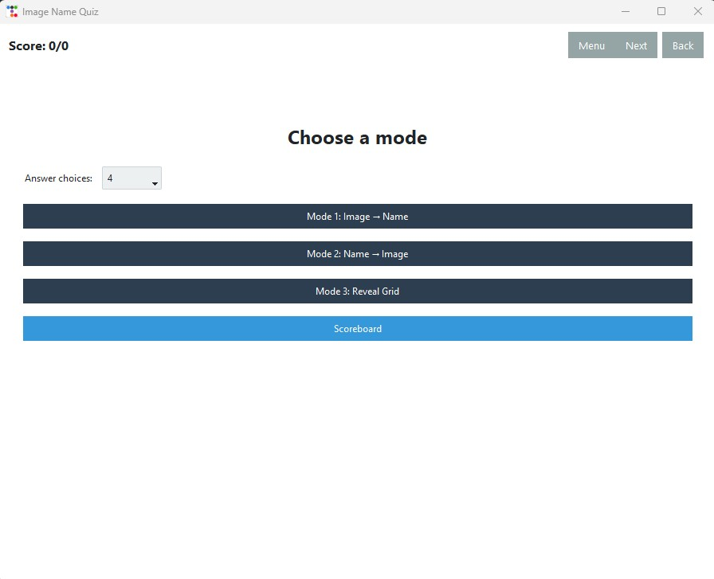
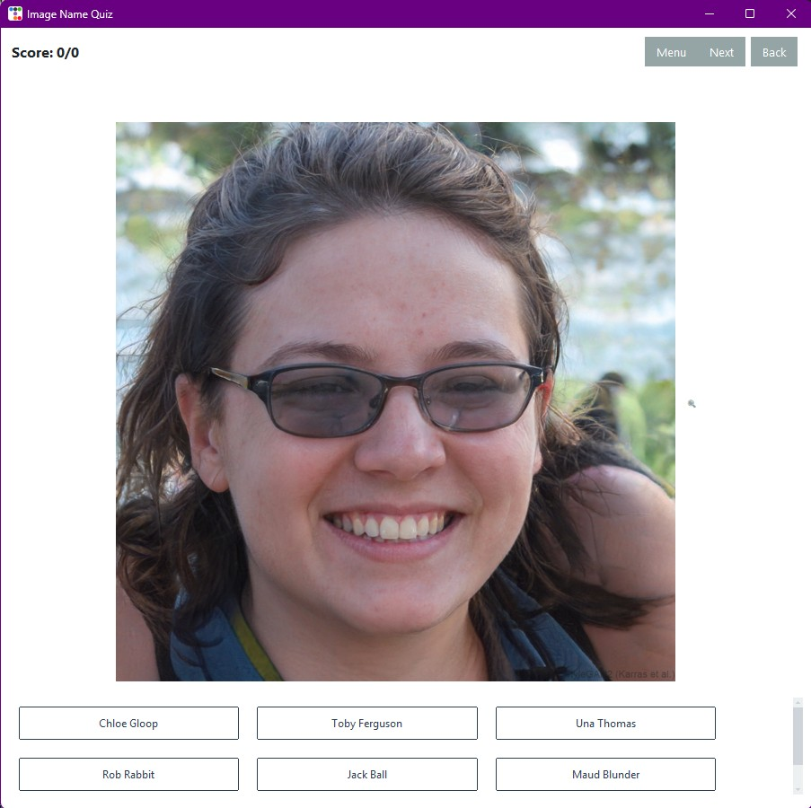
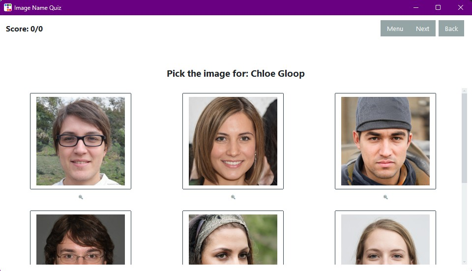
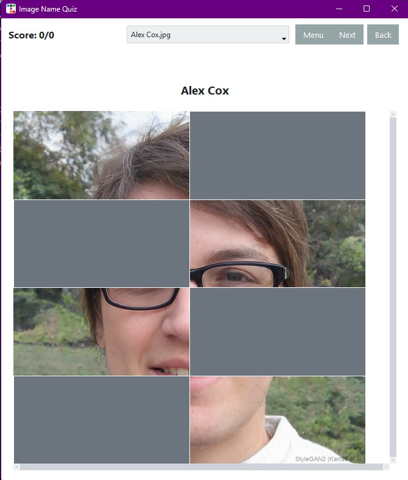
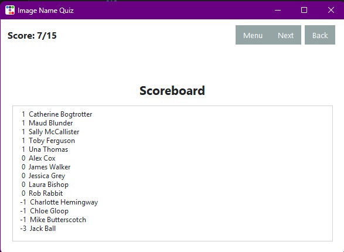

# Image Name Quiz

**A smart study tool to help you connect names to faces (or labels to diagrams).**

This desktop application (built with Tkinter + ttkbootstrap) automatically turns a folder of images into a quiz. It was generated using GPT-5.2 via GitHub Copilot and is open for public use.



## Key Features

* **Zero Configuration:** Just drop images in a folder. The filename becomes the answer.
* **Smart Scoring:** The app tracks which images you get wrong and asks them more frequently.
* **Customizable:** Choose how many options to display (from 4 up to "All").

## Setup

```powershell
python -m venv .venv
.\.venv\Scripts\Activate.ps1
pip install -r requirements.txt
```

## Add your images

Put images into the `img/` folder (next to `image_quiz.py`). Supported: `.png`, `.jpg`, `.jpeg`, `.gif`, `.bmp`.

### Note about the sample images in this repo

The `img/` folder in this repository includes **AI-generated** (fake) pictures of people that were used for testing/demo purposes.

- Faces were taken from https://thispersondoesnotexist.com/
- Names were taken from https://www.name-generator.org.uk/fake/

Important: the “name” shown in the quiz is driven by the **image file name**.
- Example: `Ada Lovelace.jpg` is displayed as `Ada Lovelace`.
- The extension is removed for display, but the underlying answer is tied to the filename.

_** Adding or removing images will not break the program. On startup, the app scans `img/` and automatically uses whatever files are present. If you remove images that previously had scores, those stale scoreboard entries are automatically dropped._

## Run

```powershell
python image_quiz.py
```

## Modes

- **Mode 1: Image → Name**: pick the correct filename.
  


- **Mode 2: Name → Image**: pick the correct image.
  


- **Mode 3: Reveal Grid**: reveal parts of an image.
  


## Choosing the number of options

From the menu you can choose how many answer choices to show:

- `4`, `6`, `8`, `10`: limits the number of options shown.
- `All`: uses all available images/names as options (useful for small sets; can get large).

How it applies per mode:

- **Mode 1 (Image → Name)**: shows that many **name buttons**.
- **Mode 2 (Name → Image)**: shows that many **image buttons**.
- **Mode 3 (Reveal Grid)**: uses the number to determine the grid density (more options = more tiles). If set to `All`, it uses a default of 12 tiles.

## How images are chosen

The app tries to focus your practice on images you struggle with:

- Each image has a score (see Scoreboard below).
- New questions prefer images with the **lowest score**.
- It also avoids repeating very recent images when possible (a small “recent history” buffer).
- If multiple images tie for “lowest score”, it chooses randomly among them.

## Data files

The app writes these files next to `image_quiz.py`:

- `image_quiz_settings.json` (window size + answer choices)
- `image_quiz_scores.json` (per-image score)

They’re usually user-specific, so `.gitignore` excludes them by default.

## Scoreboard

The **Scoreboard** shows each image’s score (higher = you’ve answered correctly more often).



- Correct answers add `+1` to that image.
- Incorrect answers subtract `-1` from that image.
- The scoreboard is sorted by score (highest first), then by name.

If you want to “start fresh”, you can delete `image_quiz_scores.json` (and/or `image_quiz_settings.json`). The app will recreate them.
